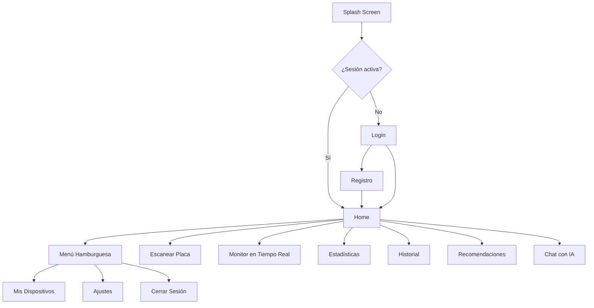
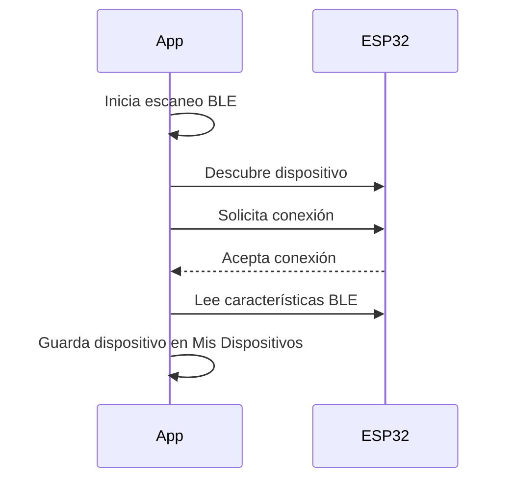
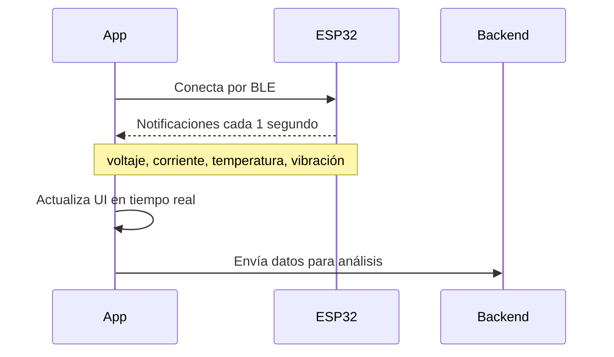

# Planificación de la App Móvil (Flutter)

---

## Tecnologías clave

| Función | Paquete Flutter |
|---|---|
| Conexión BLE al ESP32 | `flutter_blue_plus` |
| Modelo YOLO on-device | `tflite_flutter` |
| Gráficas y estadísticas | `fl_chart` |
| Navegación | `go_router` |
| Estado global | `riverpod` |
| HTTP / API calls | `dio` |
| Almacenamiento local | `hive` |
| Streaming de chat | `dio` (stream mode) |

---

## Estructura de pantallas



---

## Pantallas detalladas

### Splash Screen
- Logo del proyecto
- Verifica sesión activa y redirige

### Login / Registro
- Email y contraseña
- El usuario queda vinculado a sus dispositivos y diagnósticos en la DB

### Home
- Resumen del último diagnóstico
- Estado del dispositivo ESP32 conectado (conectado / desconectado)
- Acceso rápido a Escanear y Monitor
- Menú hamburguesa en la esquina superior izquierda

### Escanear Placa
1. Botón para tomar foto
2. YOLO procesa la imagen localmente (on-device)
3. Se muestran los componentes detectados con bounding boxes sobre la foto
4. Lista editable debajo: el usuario puede corregir, agregar o eliminar componentes
5. Botón "Analizar" → envía lista + datos ESP32 al backend
6. Navega a pantalla de Recomendaciones con los resultados

### Monitor en Tiempo Real
- Lecturas en vivo desde el ESP32 vía BLE:
  - Voltaje (gauge circular)
  - Corriente (gauge circular)
  - Temperatura (gauge circular)
  - Vibración (indicador numérico + alerta visual)
- Indicador de estado: Normal / Advertencia / Crítico
- Botón para iniciar/detener monitoreo

### Estadísticas
- Selector de dispositivo y rango de fechas
- La app consulta la tabla correcta según el rango seleccionado:
  - Últimas horas → lecturas crudas
  - Última semana → `lecturas_hora`
  - Último mes → `lecturas_dia`
  - Último año → `lecturas_mes`
  - Histórico → `lecturas_anio`
- Gráfica de línea: voltaje (avg + min/max como banda)
- Gráfica de línea: corriente (avg + min/max como banda)
- Gráfica de línea: temperatura (avg + min/max como banda)
- Histograma: frecuencia de alertas por tipo
- Tarjeta resumen: promedio, máximo y mínimo de cada variable

### Historial
- Lista de diagnósticos anteriores ordenados por fecha
- Cada item muestra: fecha, dispositivo, estado general y miniatura de la foto
- Tap para ver el diagnóstico completo con foto, lista de componentes y recomendaciones

### Recomendaciones
- Estado general del circuito (Normal / Advertencia / Crítico) con color
- Lista de componentes en riesgo (si los hay)
- Lista de alertas con severidad
- Lista de recomendaciones de mantenimiento generadas por el LLM
- Botón para guardar el diagnóstico en el historial

### Chat con IA
Mini chat contextual donde el técnico puede hacer preguntas sobre el dispositivo seleccionado.

- Selector de dispositivo activo al inicio
- Burbujas de conversación (usuario / asistente)
- El texto del asistente aparece palabra por palabra (streaming)
- El backend construye automáticamente el contexto antes de enviar al LLM:
  - Últimas lecturas eléctricas
  - Historial de alertas recientes
  - Componentes detectados en el último diagnóstico
  - Perfil de voltaje configurado
- Ejemplos de preguntas:
  - "¿Por qué está subiendo la temperatura?"
  - "¿Este voltaje es normal para un circuito de 5V?"
  - "¿Cuándo fue la última alerta crítica?"
- Historial de conversación guardado en DB por dispositivo

---
- Lista de módulos ESP32 vinculados a la cuenta
- Botón "Agregar dispositivo" → inicia escaneo BLE
- Cada dispositivo muestra: nombre, estado de conexión, último diagnóstico
- Opción para renombrar o eliminar un dispositivo

### Ajustes (menú hamburguesa)
- Perfil de voltaje por defecto: 3.3V / 5V / 12V / Personalizado
- Unidades de temperatura: °C / °F
- Notificaciones push: activar/desactivar alertas
- URL del servidor (para cambiar entre local y producción)

---

## Conexión BLE con ESP32-S3

### Flujo de vinculación (primera vez)


### Flujo de lectura de datos


### Características BLE del ESP32
| Característica | UUID | Tipo | Datos |
|---|---|---|---|
| Voltaje | `0x2B18` | Notify | Float (V) |
| Corriente | `0x2AEE` | Notify | Float (A) |
| Temperatura | `0x2A6E` | Notify | Float (°C) |
| Vibración | Custom UUID | Notify | Float (g) |
| Perfil voltaje | Custom UUID | Write | String (3.3/5/12/custom) |

---

## Navegación general

```
Splash
└── Login / Registro
    └── Home
        ├── Escanear Placa → Recomendaciones
        ├── Monitor en Tiempo Real
        ├── Estadísticas
        ├── Historial → Detalle diagnóstico
        ├── Chat con IA
        └── Menú Hamburguesa
            ├── Mis Dispositivos
            ├── Ajustes
            └── Cerrar Sesión
```

---

## Pendientes

- [ ] Definir paleta de colores y tema visual de la app
- [ ] Definir nombre final del proyecto (afecta branding de la app)
- [ ] Diseñar wireframes de las pantallas principales
- [ ] Definir esquema de notificaciones push (Firebase FCM)
