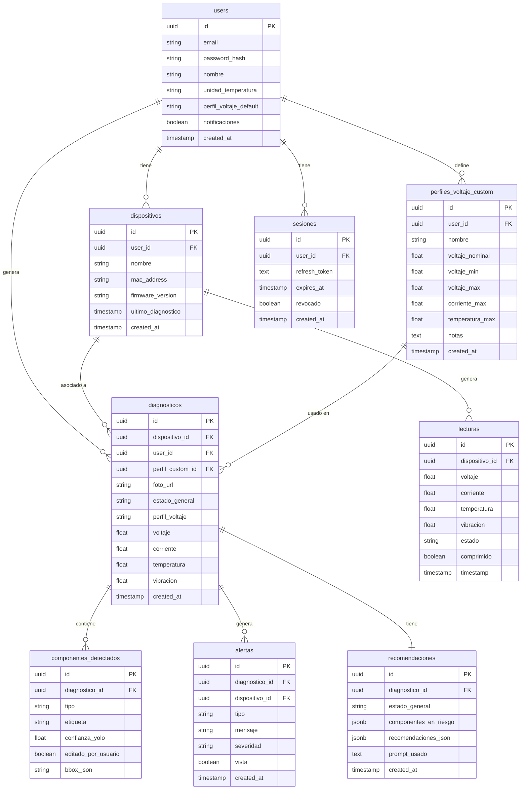

# Esquema de Base de Datos (PostgreSQL)

---

## Diagrama entidad-relación



---

## Tablas detalladas

### users
Usuarios registrados en la app.

| Campo | Tipo | Descripción |
|---|---|---|
| id | UUID PK | Identificador único |
| email | VARCHAR(255) UNIQUE | Correo de acceso |
| password_hash | VARCHAR(255) | Contraseña hasheada (bcrypt) |
| nombre | VARCHAR(100) | Nombre del técnico |
| unidad_temperatura | VARCHAR(3) | `°C` o `°F` |
| perfil_voltaje_default | VARCHAR(20) | `3.3V`, `5V`, `12V`, `custom` |
| notificaciones | BOOLEAN | Alertas push activadas |
| created_at | TIMESTAMP | Fecha de registro |

---

### dispositivos
Módulos ESP32-S3 vinculados a un usuario.

| Campo | Tipo | Descripción |
|---|---|---|
| id | UUID PK | Identificador único |
| user_id | UUID FK → users | Dueño del dispositivo |
| nombre | VARCHAR(100) | Nombre personalizado (ej. "Módulo Taller 1") |
| mac_address | VARCHAR(17) UNIQUE | Dirección MAC WiFi del ESP32 |
| firmware_version | VARCHAR(20) | Versión del firmware instalado |
| ultimo_diagnostico | TIMESTAMP | Fecha del último diagnóstico realizado |
| created_at | TIMESTAMP | Fecha de vinculación |

---

### diagnosticos
Cada sesión de diagnóstico realizada.

| Campo | Tipo | Descripción |
|---|---|---|
| id | UUID PK | Identificador único |
| dispositivo_id | UUID FK → dispositivos | Módulo usado |
| user_id | UUID FK → users | Técnico que realizó el diagnóstico |
| foto_url | TEXT | URL de la foto en S3 (o ruta local en MVP) |
| estado_general | VARCHAR(20) | `normal`, `advertencia`, `critico` |
| perfil_voltaje | VARCHAR(20) | Perfil usado: `3.3V`, `5V`, `12V`, `custom` |
| voltaje | FLOAT | Lectura de voltaje al momento del diagnóstico |
| corriente | FLOAT | Lectura de corriente |
| temperatura | FLOAT | Lectura de temperatura |
| vibracion | FLOAT | Lectura de vibración |
| created_at | TIMESTAMP | Fecha y hora del diagnóstico |

---

### componentes_detectados
Componentes identificados por YOLO en cada diagnóstico (editables por el usuario).

| Campo | Tipo | Descripción |
|---|---|---|
| id | UUID PK | Identificador único |
| diagnostico_id | UUID FK → diagnosticos | Diagnóstico al que pertenece |
| tipo | VARCHAR(50) | Tipo de componente: `resistencia`, `capacitor`, `led`, etc. |
| etiqueta | VARCHAR(100) | Etiqueta personalizada del usuario (ej. "R1", "C3") |
| confianza_yolo | FLOAT | Porcentaje de confianza del modelo (0.0 - 1.0) |
| editado_por_usuario | BOOLEAN | Si el usuario modificó este componente |
| bbox_json | TEXT | Coordenadas del bounding box en la foto (JSON) |

---

### lecturas
Serie de tiempo de lecturas eléctricas del ESP32. Base para estadísticas y gráficas.

| Campo | Tipo | Descripción |
|---|---|---|
| id | UUID PK | Identificador único |
| dispositivo_id | UUID FK → dispositivos | Módulo que generó la lectura |
| voltaje | FLOAT | Voltaje medido (V) |
| corriente | FLOAT | Corriente medida (A) |
| temperatura | FLOAT | Temperatura medida (°C) |
| vibracion | FLOAT | Vibración medida (g) |
| estado | VARCHAR(20) | `normal`, `advertencia`, `critico` |
| timestamp | TIMESTAMP | Momento exacto de la lectura |

---

### alertas
Alertas generadas por lecturas fuera de rango.

| Campo | Tipo | Descripción |
|---|---|---|
| id | UUID PK | Identificador único |
| diagnostico_id | UUID FK → diagnosticos | Diagnóstico relacionado (nullable) |
| dispositivo_id | UUID FK → dispositivos | Dispositivo que generó la alerta |
| tipo | VARCHAR(30) | `voltaje`, `corriente`, `temperatura`, `vibracion` |
| mensaje | TEXT | Descripción de la alerta |
| severidad | VARCHAR(20) | `info`, `advertencia`, `critico` |
| vista | BOOLEAN | Si el usuario ya la vio |
| created_at | TIMESTAMP | Momento de la alerta |

---

### recomendaciones
Respuesta del LLM para cada diagnóstico.

| Campo | Tipo | Descripción |
|---|---|---|
| id | UUID PK | Identificador único |
| diagnostico_id | UUID FK → diagnosticos | Diagnóstico analizado |
| estado_general | VARCHAR(20) | `normal`, `advertencia`, `critico` |
| componentes_en_riesgo | TEXT | JSON array con etiquetas de componentes en riesgo |
| recomendaciones_json | TEXT | JSON array con las recomendaciones generadas |
| prompt_usado | TEXT | Prompt enviado al LLM (para auditoría y mejora) |
| created_at | TIMESTAMP | Fecha de generación |

---

### chat_mensajes
Historial de conversaciones del mini chat con el LLM por dispositivo.

| Campo | Tipo | Descripción |
|---|---|---|
| id | UUID PK | Identificador único |
| user_id | UUID FK → users | Usuario que envió el mensaje |
| dispositivo_id | UUID FK → dispositivos | Dispositivo sobre el que se pregunta |
| rol | VARCHAR(10) | `user` o `assistant` |
| contenido | TEXT | Texto del mensaje |
| contexto_usado | JSONB | Snapshot del contexto enviado al LLM (lecturas, alertas, componentes) |
| created_at | TIMESTAMP | Momento del mensaje |

---

```sql
-- Lecturas por dispositivo y tiempo (para gráficas de estadísticas)
CREATE INDEX idx_lecturas_dispositivo_tiempo ON lecturas(dispositivo_id, timestamp DESC);

-- Diagnósticos por usuario ordenados por fecha
CREATE INDEX idx_diagnosticos_usuario ON diagnosticos(user_id, created_at DESC);

-- Alertas no vistas por dispositivo
CREATE INDEX idx_alertas_no_vistas ON alertas(dispositivo_id, vista) WHERE vista = false;

-- Chat por dispositivo y usuario ordenado por fecha
CREATE INDEX idx_chat_dispositivo ON chat_mensajes(dispositivo_id, user_id, created_at ASC);
```

---

### perfiles_voltaje_custom
Rangos personalizados de voltaje definidos por el usuario. Se usan como contexto adicional para el LLM.

| Campo | Tipo | Descripción |
|---|---|---|
| id | UUID PK | Identificador único |
| user_id | UUID FK → users | Usuario que creó el perfil |
| nombre | VARCHAR(100) | Nombre descriptivo (ej. "PLC Siemens 24V") |
| voltaje_nominal | FLOAT | Voltaje esperado (V) |
| voltaje_min | FLOAT | Límite inferior aceptable (V) |
| voltaje_max | FLOAT | Límite superior aceptable (V) |
| corriente_max | FLOAT | Corriente máxima aceptable (A) |
| temperatura_max | FLOAT | Temperatura máxima aceptable (°C) |
| notas | TEXT | Contexto adicional para el LLM (tipo de equipo, fabricante, etc.) |
| created_at | TIMESTAMP | Fecha de creación |

---

### sesiones
Manejo de JWT con access + refresh tokens.

| Campo | Tipo | Descripción |
|---|---|---|
| id | UUID PK | Identificador único |
| user_id | UUID FK → users | Usuario de la sesión |
| refresh_token | TEXT UNIQUE | Token de refresco (hasheado) |
| expires_at | TIMESTAMP | Expiración del refresh token (30 días) |
| created_at | TIMESTAMP | Fecha de creación |
| revocado | BOOLEAN | Si el token fue revocado (logout) |

> Access token: duración 30 minutos, firmado con JWT, no se guarda en DB.
> Refresh token: duración 30 días, se guarda hasheado en esta tabla.

---

## Estrategia de retención de lecturas

En lugar de comprimir la tabla `lecturas`, se usan **tablas de agregados separadas** por granularidad. Los datos crudos se conservan 7 días y los agregados se guardan indefinidamente.

### Tablas de agregados

Todas comparten la misma estructura base con campos adicionales de `min` y `max` para capturar picos:

| Tabla | Granularidad | Generada por | Retención |
|---|---|---|---|
| `lecturas` | 1/segundo (cruda) | ESP32 en tiempo real | 7 días |
| `lecturas_hora` | Promedio por hora | Job cada hora | Indefinida |
| `lecturas_dia` | Promedio por día | Job cada día | Indefinida |
| `lecturas_mes` | Promedio por mes | Job cada mes | Indefinida |
| `lecturas_anio` | Promedio por año | Job cada año | Indefinida |

### Estructura de tablas de agregados

Cada tabla de agregados (`lecturas_hora`, `lecturas_dia`, `lecturas_mes`, `lecturas_anio`) tiene:

| Campo | Tipo | Descripción |
|---|---|---|
| id | UUID PK | Identificador único |
| dispositivo_id | UUID FK → dispositivos | Módulo origen |
| voltaje_avg | FLOAT | Promedio de voltaje |
| voltaje_min | FLOAT | Mínimo del periodo |
| voltaje_max | FLOAT | Máximo del periodo |
| corriente_avg | FLOAT | Promedio de corriente |
| corriente_min | FLOAT | Mínimo del periodo |
| corriente_max | FLOAT | Máximo del periodo |
| temperatura_avg | FLOAT | Promedio de temperatura |
| temperatura_min | FLOAT | Mínimo del periodo |
| temperatura_max | FLOAT | Máximo del periodo |
| vibracion_avg | FLOAT | Promedio de vibración |
| vibracion_max | FLOAT | Máximo del periodo |
| periodo_inicio | TIMESTAMP | Inicio del periodo agregado |

### Consulta según rango en la app

| Vista en app | Tabla consultada |
|---|---|
| Últimas horas | `lecturas` (crudas) |
| Última semana | `lecturas_hora` |
| Último mes | `lecturas_dia` |
| Último año | `lecturas_mes` |
| Histórico total | `lecturas_anio` |

### Contexto para el LLM

Los agregados permiten construir contexto rico para el chat y las recomendaciones:
- Tendencias de temperatura en las últimas 24 horas
- Picos de corriente en el último mes
- Comparación del estado actual vs promedio histórico

### Estimación de almacenamiento por dispositivo

| Tabla | Registros/año | Tamaño aprox. |
|---|---|---|
| `lecturas` (7 días) | ~600K | ~50 MB |
| `lecturas_hora` | ~8,760 | < 1 MB |
| `lecturas_dia` | ~365 | < 1 MB |
| `lecturas_mes` | ~12 | Insignificante |
| `lecturas_anio` | ~1/año | Insignificante |

> Total por dispositivo por año: **~52 MB**, escalable indefinidamente.

---

## Notas de implementación

- Todos los IDs son UUID v4 para facilitar la migración a AWS sin conflictos
- Las fotos se guardan en ruta local durante el MVP y en S3 en producción (solo cambia `foto_url`)
- `recomendaciones_json` y `componentes_en_riesgo` usan tipo `JSONB` de PostgreSQL para consultas eficientes
- El perfil custom se incluye completo en el prompt al LLM para dar máximo contexto
- La tabla `lecturas` usa particionado por mes en producción para consultas más rápidas

---

## Pendientes

- [ ] Definir job de compresión: ¿automático cada noche o manual?
- [ ] Agregar campo `comprimido` en `lecturas` para distinguir datos crudos de agregados
