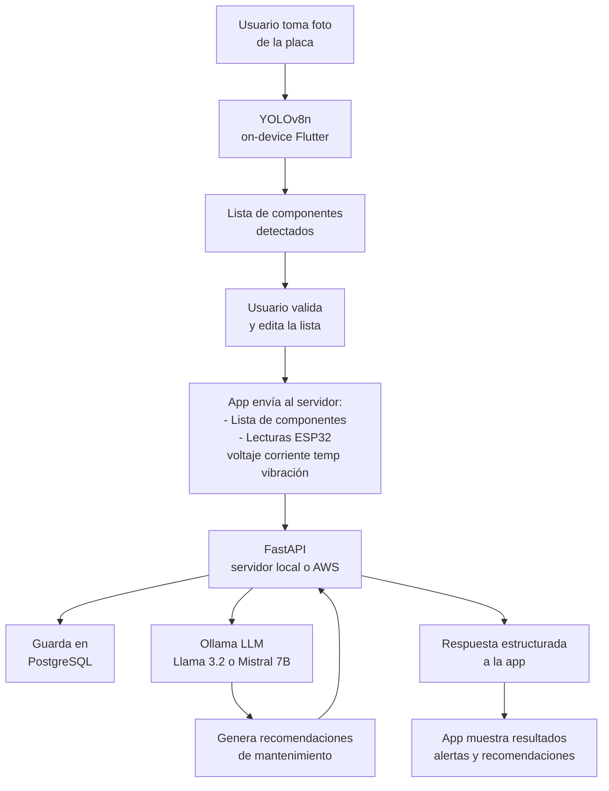

# Arquitectura de Inteligencia Artificial

---

## Visión general

El sistema utiliza dos modelos de IA con responsabilidades distintas:

| Modelo | Tipo | Dónde corre | Función |
|---|---|---|---|
| YOLOv8n | Visión artificial (detección de objetos) | Celular (on-device) | Identificar componentes electrónicos en la foto |
| Llama 3.2 3B / Mistral 7B | LLM (lenguaje) | Servidor local → AWS | Analizar variables eléctricas y generar recomendaciones |

---

## Flujo completo



---

## Módulo 1: Visión Artificial (YOLO on-device)

### Modelo
- **Base:** YOLOv8n (nano) — versión más ligera, optimizada para móvil
- **Formato de exportación:** TFLite (para Flutter)
- **Integración Flutter:** paquete `tflite_flutter`

### Componentes a detectar (MVP)
| Componente | Ejemplos |
|---|---|
| Resistencia | THT, SMD |
| Capacitor | Electrolítico, cerámico |
| LED | 3mm, 5mm, SMD |
| Transistor | BJT, MOSFET |
| Circuito integrado | DIP, SOIC |
| Diodo | Rectificador, Zener |
| Inductor / Bobina | THT, SMD |
| Conector | JST, pin header |

### Dataset
- **Fuente base:** Roboflow Universe (datasets públicos de componentes electrónicos)
- **Complemento:** Fotos propias etiquetadas con Roboflow Annotate
- **Tamaño mínimo recomendado:** 500–1000 imágenes por clase para el MVP
- **Entrenamiento:** Google Colab (GPU gratuita) con Ultralytics YOLOv8

### Pipeline de entrenamiento
```
Recolección de imágenes
    ↓
Etiquetado en Roboflow
    ↓
Exportar dataset (formato YOLOv8)
    ↓
Entrenar en Google Colab
    ↓
Exportar modelo a TFLite
    ↓
Integrar en Flutter
```

---

## Módulo 2: LLM para recomendaciones (Ollama)

### Modelo
- **MVP (local):** Llama 3.2 3B — corre bien en CPU con 32GB RAM
- **Alternativa:** Mistral 7B — mejor calidad, requiere más recursos
- **Aceleración:** OpenVINO de Intel (compatible con Intel Arc)
- **Producción (AWS):** AWS Bedrock con Claude Haiku o migración de Ollama a EC2

### Hardware del servidor MVP
- Laptop con Intel Core Ultra 5 125H
- GPU Intel Arc (integrada)
- 32GB RAM
- Ollama con soporte OpenVINO para aceleración en Arc

### Exposición local
- **ngrok** para exponer el servidor local a internet durante el MVP
- La app Flutter usa la URL de ngrok como endpoint
- En producción se reemplaza por la URL de AWS sin cambiar el código

### Prompt al LLM
El backend construye un prompt estructurado con los datos del diagnóstico:

```
Eres un sistema experto en mantenimiento preventivo de circuitos electrónicos.

Componentes identificados: [lista]
Perfil de voltaje: [3.3V / 5V / 12V]
Lecturas actuales:
  - Voltaje: X.XV (rango normal: X.X - X.XV)
  - Corriente: X.XXA (rango normal: X.XX - X.XXA)
  - Temperatura: XX°C (rango normal: XX - XX°C)
  - Vibración: X.Xg (rango normal: < X.Xg)

Historial de las últimas N sesiones: [resumen]

Genera un diagnóstico de mantenimiento preventivo indicando:
1. Estado general del circuito
2. Componentes en riesgo (si los hay)
3. Recomendaciones concretas de mantenimiento
```

### Respuesta estructurada (JSON)
```json
{
  "estado_general": "normal | advertencia | critico",
  "componentes_en_riesgo": ["C3", "R12"],
  "alertas": [
    {
      "tipo": "temperatura",
      "mensaje": "Temperatura elevada sostenida en zona de capacitores",
      "severidad": "advertencia"
    }
  ],
  "recomendaciones": [
    "Revisar capacitor C3 en la próxima sesión de mantenimiento",
    "Verificar ventilación del circuito"
  ]
}
```

---

## Infraestructura

### MVP (local)
| Componente | Tecnología |
|---|---|
| Servidor backend | FastAPI en laptop |
| Base de datos | PostgreSQL local |
| LLM | Ollama + Llama 3.2 3B |
| Exposición a internet | ngrok |
| YOLO | TFLite en el celular |

### Producción (AWS)
| Componente | Tecnología |
|---|---|
| Servidor backend | EC2 t3.small |
| Base de datos | RDS PostgreSQL |
| LLM | AWS Bedrock (Claude Haiku) o Ollama en EC2 |
| Almacenamiento de fotos | S3 |
| YOLO | TFLite en el celular (sin cambios) |

> La migración de MVP a producción solo requiere cambiar variables de entorno. El código no cambia.

---

## Pendientes

- [ ] Buscar y evaluar datasets de componentes en Roboflow Universe
- [ ] Definir número mínimo de clases para el MVP
- [ ] Entrenar primer modelo YOLOv8n en Google Colab
- [ ] Instalar y probar Ollama con Llama 3.2 3B en la laptop
- [ ] Probar aceleración con OpenVINO en Intel Arc
- [ ] Diseñar esquema de la base de datos PostgreSQL
