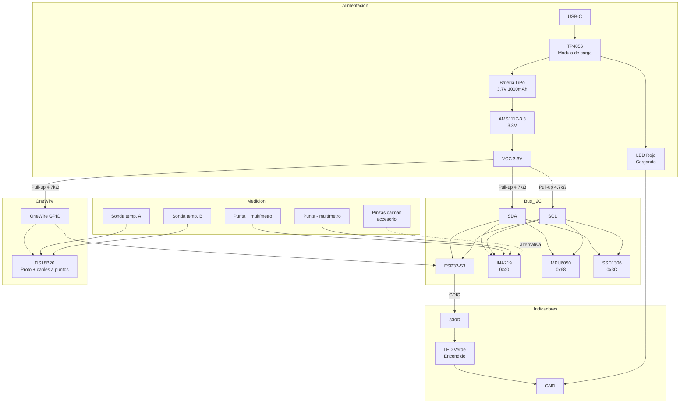

# Diseño del Módulo de Hardware

---

## Lista de componentes

### Componentes principales

| # | Componente | Modelo | Cantidad | Función |
|---|---|---|---|---|
| 1 | Microcontrolador | ESP32-S3 | 1 | Cerebro del módulo |
| 2 | Sensor voltaje/corriente | INA219 (módulo) | 1 | Mide voltaje y corriente |
| 3 | Sensor de temperatura | DS18B20 | 1 | Temperatura — montado en proto con cables a puntos específicos |
| 4 | Sensor de vibración | MPU6050 (módulo) | 1 | Acelerómetro + giroscopio |
| 5 | Pantalla | OLED 0.96" SSD1306 | 1 | Lectura local |
| 6 | Módulo de carga | TP4056 con protección | 1 | Carga la LiPo por USB-C |
| 7 | Batería | LiPo 3.7V 1000mAh | 1 | Alimentación portátil |

### Componentes pasivos y auxiliares

| # | Componente | Valor | Cantidad | Función |
|---|---|---|---|---|
| 8 | Resistencia pull-up | 4.7kΩ | 2 | Bus I2C (SDA y SCL) |
| 9 | Resistencia pull-up | 4.7kΩ | 1 | Línea OneWire del DS18B20 |
| 10 | Capacitor de desacople | 100nF (cerámico) | 5 | Filtro de ruido en VCC de cada módulo |
| 11 | Capacitor de desacople | 10µF (electrolítico) | 1 | Estabilización general de alimentación |
| 12 | LED indicador | Verde 5mm | 1 | Módulo encendido |
| 13 | LED indicador | Rojo 5mm | 1 | Cargando batería (señal del TP4056) |
| 14 | Resistencia limitadora LED | 330Ω | 2 | Protección de LEDs indicadores |
| 15 | Regulador 3.3V | AMS1117-3.3 | 1 | Alimentar ESP32 y sensores desde la LiPo |
| 16 | Sondas de prueba | Puntas tipo multímetro | 2 | Conexión al circuito bajo prueba (INA219) — mango plástico con punta metálica fina |
| 17 | Cables con puntas de prueba | Dupont + punta fina | 2 | Sondas del DS18B20 para puntos específicos |
| 18 | Pinzas caimán | Con cable dupont | 2 | Accesorio para dejar manos libres o cables gruesos |
| 19 | Cables dupont | M-M / M-F | ~20 | Conexiones en protoboard |

---

## Diagrama de conexiones (solo hardware)



---

## Mapa de pines ESP32-S3

| Pin ESP32-S3 | Función | Conectado a |
|---|---|---|
| GPIO 8 | I2C SDA | INA219, MPU6050, SSD1306 |
| GPIO 9 | I2C SCL | INA219, MPU6050, SSD1306 |
| GPIO 4 | OneWire | DS18B20 |
| GPIO 2 | LED indicador | Resistencia 330Ω → LED |
| 3V3 | Alimentación | VCC de todos los módulos |
| GND | Tierra común | GND de todos los módulos |

---

## Perfiles de voltaje seleccionables

El perfil se selecciona desde la app. El hardware no cambia, solo cambian los umbrales en el backend.

| Perfil | Voltaje nominal | Rango aceptable |
|---|---|---|
| 3.3V | 3.3V | 3.0V – 3.6V |
| 5V | 5V | 4.75V – 5.25V |
| 12V | 12V | 11.5V – 12.5V |
| Personalizado | Definido por usuario | Configurable |

> El INA219 soporta hasta 26V nativamente. Para voltajes mayores se requiere divisor de voltaje externo.

---

## Notas de la protoboard

- Todos los módulos (INA219, MPU6050, SSD1306, TP4056) son breakouts con pines, se insertan directo en la protoboard
- Las resistencias pull-up de I2C van entre VCC 3.3V y las líneas SDA/SCL
- La resistencia pull-up del DS18B20 va entre VCC 3.3V y el pin DATA del sensor
- El DS18B20 se monta en la protoboard y sus cables de medición tienen puntas de prueba en los extremos para tocar puntos específicos de la placa bajo análisis
- Los capacitores de desacople (100nF) van lo más cerca posible al pin VCC de cada módulo
- El capacitor de 10µF va en la salida del regulador AMS1117
- El TP4056 alimenta la LiPo y también puede alimentar el circuito mientras carga (paso a través)
- El LED rojo está conectado al pin CHRG del TP4056 (se enciende mientras carga)

---

## Cálculo de autonomía

### Consumo estimado por componente (WiFi activo)

| Componente | Consumo típico |
|---|---|
| ESP32-S3 (WiFi activo) | 240mA |
| INA219 | 1mA |
| MPU6050 | 3.9mA |
| DS18B20 | 1.5mA |
| SSD1306 OLED | 20mA |
| AMS1117 (pérdidas regulador) | 5mA |
| LEDs x2 | 10mA |
| **Total** | **~281mA** |

> Factor de eficiencia del regulador AMS1117: 85%  
> Consumo real efectivo: ~281 / 0.85 ≈ **331mA**

### Autonomía según capacidad de batería

| Batería LiPo | Autonomía estimada |
|---|---|
| 500mAh | ~1.5 horas |
| 1000mAh | ~3 horas |
| 2000mAh | ~6 horas |
| 3000mAh | ~9 horas |

> **Recomendación: LiPo 2000mAh** — cubre una jornada de trabajo completa con margen.

> Con **deep sleep** entre lecturas el ESP32-S3 baja a ~10µA, lo que puede multiplicar la autonomía x10 o más dependiendo del intervalo de muestreo configurado.

---

## Comunicación ESP32 → Backend

El ESP32 envía las lecturas directamente al backend por **WiFi** (HTTP POST cada segundo). La app consulta las lecturas al backend, no al ESP32 directamente. BLE queda como feature futuro para entornos sin WiFi.

```
ESP32-S3
   ↓ WiFi (HTTP POST /lecturas cada 1s)
Backend FastAPI
   ↓
PostgreSQL
   ↓
App Flutter (consulta al backend)
```

---

## Cómo conectar las sondas al circuito bajo prueba

El INA219 se conecta **en serie** en la línea de alimentación de la placa. La corriente de operación pasa por él y lo mide.

```
Fuente de poder / VCC externo
         |
      [VIN+ INA219]
      [VIN- INA219]
         |
   Placa bajo prueba (VCC)
         |
        GND
```

**Regla práctica:** conectar en el punto donde entra la alimentación de operación, no donde se carga una batería.

**Aplica para:** Arduino, ESP32, PCBs industriales con barrel jack o conector de poder, cualquier placa con fuente externa.

**No aplica para:** baterías cargándose (la corriente va hacia la batería, no hacia el circuito).

### Perfil de voltaje — baseline automático

Si el técnico no conoce el voltaje nominal de la placa:
- Las primeras 20 lecturas se usan como **baseline** (estado normal)
- El sistema calcula el promedio y lo usa como referencia para detectar desviaciones
- El técnico puede corregirlo manualmente desde la app en cualquier momento

Si el técnico sí conoce el voltaje:
- Selecciona el perfil (3.3V / 5V / 12V / Personalizado) antes de iniciar


## Pendientes

- [ ] Esquemático visual en Fritzing
- [ ] Definir batería LiPo final y agregar en lista de componentes
- [ ] Implementar lógica de baseline automático en firmware ESP32
