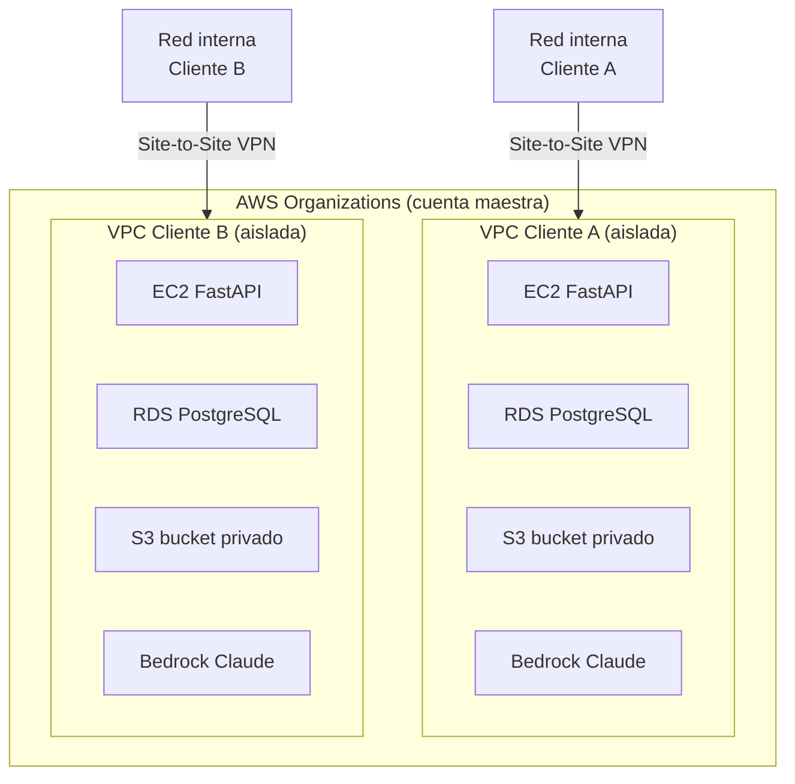

# Escalabilidad y Seguridad

---

## Etapas de crecimiento

```
MVP                    →    Producto V1.0           →    Plataforma SaaS
────────────────────────────────────────────────────────────────────────
Laptop + ngrok         →    AWS EC2 + RDS           →    ECS + Aurora + CDN
1 usuario              →    ~100 usuarios           →    1,000–10,000 usuarios
Ollama local           →    Bedrock Claude Haiku    →    Fine-tuning propio
PostgreSQL local       →    RDS PostgreSQL          →    Aurora Serverless v2
Sin auth robusta       →    JWT + HTTPS             →    OAuth2 + MFA + WAF
```

---

## Arquitectura por etapa

### MVP — Laptop local
```
App Flutter
    ↓ HTTPS (ngrok)
FastAPI (laptop)
    ↓
PostgreSQL (local) + Ollama (local)
```
Costo: $0

---

### V1.0 — AWS básico (~100 usuarios)
```
App Flutter
    ↓ HTTPS
EC2 t3.small (FastAPI)
    ↓              ↓
RDS PostgreSQL    S3 (fotos)
    ↓
Bedrock Claude Haiku (LLM)
```

| Servicio | Especificación | Costo estimado/mes |
|---|---|---|
| EC2 t3.small | 2 vCPU, 2GB RAM | ~$15 USD |
| RDS db.t3.micro | PostgreSQL, 20GB | ~$15 USD |
| S3 | ~10GB fotos | ~$0.25 USD |
| Bedrock Claude Haiku | ~500K tokens/mes | ~$0.50 USD |
| ngrok → Route 53 + ACM | Dominio + SSL | ~$1 USD |
| **Total** | | **~$32 USD/mes** |

---

### V2.0 — AWS escalado (~1,000 usuarios)
```
App Flutter
    ↓ CloudFront + WAF
ALB (Load Balancer)
    ↓
ECS Fargate (FastAPI x2-4 instancias)
    ↓                    ↓
Aurora PostgreSQL       S3 + CloudFront
    ↓
Bedrock Claude Haiku
    ↓
ElastiCache Redis (caché de contexto LLM)
```

| Servicio | Especificación | Costo estimado/mes |
|---|---|---|
| ECS Fargate | 2 tareas x 0.5 vCPU / 1GB | ~$30 USD |
| Aurora Serverless v2 | Auto-escala, 50GB | ~$50 USD |
| S3 + CloudFront | ~100GB fotos + CDN | ~$10 USD |
| Bedrock Claude Haiku | ~5M tokens/mes | ~$5 USD |
| ALB | Load balancer | ~$20 USD |
| ElastiCache Redis | t3.micro | ~$15 USD |
| WAF | Reglas básicas | ~$10 USD |
| **Total** | | **~$140 USD/mes** |

---

### SaaS — AWS enterprise (~10,000 usuarios)
```
App Flutter
    ↓ CloudFront + WAF + Shield
ALB
    ↓
ECS Fargate (FastAPI auto-scaling)
    ↓                    ↓                  ↓
Aurora PostgreSQL    S3 + CloudFront    SQS (cola de jobs)
    ↓                                       ↓
Bedrock / Fine-tuned model            Lambda (agregación)
    ↓
ElastiCache Redis
```

| Servicio | Especificación | Costo estimado/mes |
|---|---|---|
| ECS Fargate | Auto-scaling 2-10 tareas | ~$150 USD |
| Aurora PostgreSQL | Multi-AZ, 500GB | ~$200 USD |
| S3 + CloudFront | ~1TB fotos + CDN | ~$50 USD |
| Bedrock / LLM | ~50M tokens/mes | ~$50 USD |
| ALB + WAF + Shield | Protección DDoS | ~$60 USD |
| ElastiCache Redis | Cluster mode | ~$50 USD |
| SQS + Lambda | Jobs de agregación | ~$5 USD |
| **Total** | | **~$565 USD/mes** |

> Con 10,000 usuarios a $99 MXN/mes (~$5 USD) = $50,000 USD/mes de ingreso.
> Margen operativo de infraestructura: ~99%.

---

### Tier 3 — Tenant aislado en AWS (privacidad total por cliente)

Para empresas que requieren que sus datos estén completamente aislados de otros clientes por políticas de seguridad, regulaciones o confidencialidad industrial (automotriz, farmacéutica, defensa, gobierno).

Cada cliente obtiene su propia **VPC dedicada en AWS**, administrada por nosotros desde una cuenta maestra con AWS Organizations.



**Características del tenant aislado:**
- VPC propia por cliente — sin posibilidad de acceso cruzado entre tenants
- RDS PostgreSQL en subred privada — sin acceso público a internet
- S3 bucket privado — solo accesible desde su VPC
- Bedrock Claude con acceso desde su VPC
- Security Groups + NACLs como firewall por capas
- AWS Site-to-Site VPN para conectar su red interna con su VPC
- Opción de VPC Peering si el cliente ya tiene infraestructura en AWS
- Nosotros administramos todo — el cliente no necesita equipo de DevOps

**Costo estimado por tenant aislado:**

| Servicio | Especificación | Costo/mes |
|---|---|---|
| EC2 t3.small | FastAPI dedicado | ~$15 USD |
| RDS db.t3.micro | PostgreSQL dedicado | ~$15 USD |
| S3 | Bucket privado ~10GB | ~$0.25 USD |
| Bedrock Claude Haiku | Uso del cliente | ~$5–20 USD |
| Site-to-Site VPN | Conexión a red interna | ~$36 USD |
| **Total infraestructura** | | **~$71–86 USD/mes** |

> Nosotros cobramos la infraestructura + margen de servicio. El cliente no ve AWS, solo paga la licencia.

---

## Seguridad por capa

### Autenticación y autorización
| Medida | MVP | Producción |
|---|---|---|
| Contraseñas | bcrypt (cost 12) | bcrypt (cost 12) |
| Tokens | JWT access (30min) + refresh (30d) | JWT + rotación automática |
| HTTPS | ngrok (automático) | ACM + CloudFront |
| Rate limiting | — | SlowAPI en FastAPI |
| MFA | — | TOTP (Google Authenticator) |

### Datos en tránsito
- HTTPS obligatorio en todos los endpoints
- WiFi con red segura (WPA2/WPA3) entre ESP32 y router
- Certificados SSL/TLS gestionados por AWS ACM (gratis)

### Datos en reposo
- Contraseñas hasheadas con bcrypt, nunca en texto plano
- Refresh tokens hasheados en DB (nunca el token real)
- Fotos en S3 con acceso privado (URLs firmadas con expiración)
- RDS con cifrado en reposo (AES-256, activado por defecto en AWS)

### API
| Medida | Descripción |
|---|---|
| Rate limiting | Máx. 100 req/min por usuario (SlowAPI) |
| Validación | Pydantic valida todos los inputs |
| CORS | Solo orígenes permitidos |
| WAF | Bloqueo de IPs maliciosas y SQL injection (producción) |
| Logs | CloudWatch para auditoría de accesos |

### ESP32
- El dispositivo se conecta al backend por WiFi con HTTPS
- Solo acepta comandos del usuario autenticado mediante token JWT
- Firmware con OTA (Over The Air) para actualizaciones de seguridad

---

## Estrategia de migración MVP → Producción

Solo requiere cambiar variables de entorno, el código no cambia:

```env
# MVP (laptop)
DATABASE_URL=postgresql://localhost:5432/db
OLLAMA_BASE_URL=http://localhost:11434
FOTO_STORAGE=local

# Producción (AWS)
DATABASE_URL=postgresql://rds-endpoint:5432/db
OLLAMA_BASE_URL=https://bedrock-endpoint
FOTO_STORAGE=s3
S3_BUCKET=nombre-bucket
```

---

## Resumen de costos por etapa

| Etapa | Usuarios | Costo infra/mes | Ingreso potencial/mes |
|---|---|---|---|
| MVP | 1-5 | $0 | $0 (competencia) |
| V1.0 | ~100 | ~$32 USD | ~$500 USD |
| V2.0 | ~1,000 | ~$140 USD | ~$5,000 USD |
| SaaS multi-tenant | ~10,000 | ~$565 USD | ~$50,000 USD |
| Tenant aislado (por cliente) | 1 empresa | ~$86 USD | $3,000–6,000 MXN/mes |

---

## Pendientes

- [ ] Definir política de backups de RDS (frecuencia y retención)
- [ ] Evaluar si usar Cognito para auth en producción vs JWT propio
- [ ] Definir SLA de disponibilidad objetivo (99.9% = ~8.7h downtime/año)
