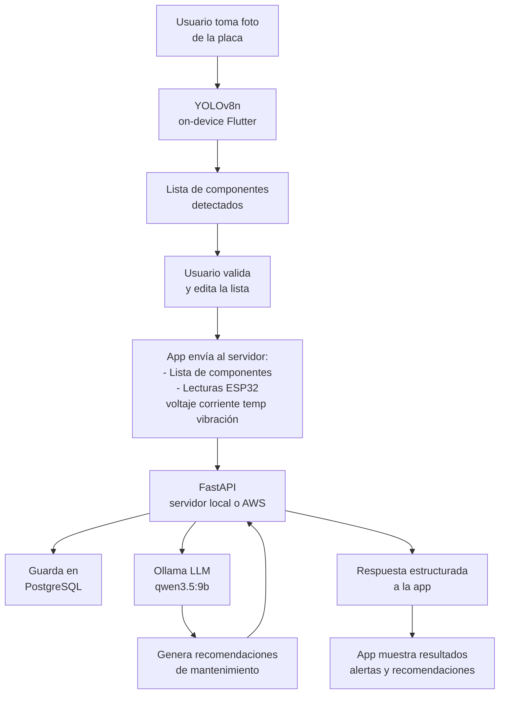

# Arquitectura de Inteligencia Artificial

---

## Visión general

El sistema utiliza dos modelos de IA con responsabilidades distintas:

| Modelo | Tipo | Dónde corre | Función |
|---|---|---|---|
| YOLOv8n (ARGOS) | Visión artificial (detección de objetos) | Celular (on-device) | Identificar componentes electrónicos en la foto |
| qwen3.5:9b / Claude Haiku | LLM (lenguaje) | Servidor local → AWS | Analizar variables eléctricas y generar recomendaciones |

---

## Flujo completo



---

## Módulo 1: Visión Artificial (YOLO on-device)

### Modelo
- **Base:** YOLOv8n (nano) — versión más ligera, optimizada para móvil
- **Formato de exportación:** TFLite float32 (para Flutter)
- **Integración Flutter:** paquete `tflite_flutter`
- **Archivo:** `Desarollo/Modelo_IA_TensorFlowLite/best_float32.tflite` (12 MB)
- **Clases:** `Desarollo/Modelo_IA_TensorFlowLite/data.yaml`

### Dataset utilizado
- **ElectroCom-61 v9** — 61 clases de componentes electrónicos y sensores Arduino (Roboflow Universe, licencia CC BY 4.0)
- **Dataset de PCB** — componentes en placas de circuito
- **Total fusionado:** 2,976 imágenes (Train: 2,182 / Val: 553 / Test: 321)
- **Resolución de entrenamiento:** 512x512

### Resultados del entrenamiento
| Métrica | Valor |
|---|---|
| mAP50 | 0.721 |
| Precision | 0.758 |
| Recall | 0.667 |
| Epochs | 50 |
| Tiempo | ~26 min (Tesla T4, Google Colab) |

### Clases principales detectadas
`resistor`, `capacitor`, `led`, `transistor`, `ic`, `diode`, `buzzer`, `relay`, `inductor`, `potentiometer`, `switch`, `display`, `Arduino`, `Arduino Mega`, `Esp32`, `Capacitor electrolitico`, `Diodo`, `Driver de motor L298N`, y más.

> Nota: el dataset de PCB tiene clases con nombres numéricos (20-60). Se mapearán a nombres descriptivos en Flutter con un diccionario local.

### Pipeline de entrenamiento (completado)
```
Datasets en Roboflow Universe
    ↓
Fusión en proyecto Roboflow (ARGOS v1, versión 2)
    ↓
Exportar en formato YOLOv8
    ↓
Entrenar en Google Colab (yolov8n.pt base)
    ↓
Exportar a TFLite float32
    ↓
Integrar en Flutter (pendiente)
```

---

## Módulo 2: LLM para recomendaciones (Ollama)

### Modelo
- **MVP (local):** configurable vía variable de entorno `OLLAMA_MODEL`
- **Probado con:** `qwen3.5:9b` (instalado en laptop)
- **Alternativa más rápida:** `llama3.2:3b`, `qwen2.5:3b`
- **Producción (AWS):** AWS Bedrock (Claude Haiku) o Ollama en EC2

### Hardware del servidor MVP
- Laptop con Intel Core Ultra 5 125H
- GPU Intel Arc (integrada)
- 32GB RAM
- Ollama corriendo localmente (fuera de Docker)

### Exposición local
- **ngrok** para exponer el servidor local a internet durante el MVP
- La app Flutter usa la URL de ngrok como endpoint
- En producción se reemplaza por la URL de AWS sin cambiar el código

### System prompts implementados

**Diagnóstico:**
```
Eres un experto en electrónica y mantenimiento de circuitos.
Analiza los datos del circuito y genera recomendaciones de mantenimiento preventivo en español.
Responde SIEMPRE en JSON con este formato exacto:
{
  "estado_general": "normal|advertencia|critico",
  "componentes_en_riesgo": ["etiqueta1", "etiqueta2"],
  "recomendaciones": ["recomendación 1", "recomendación 2"]
}
```

**Chat:**
```
Eres un asistente técnico experto en electrónica y mantenimiento de circuitos.
Tienes acceso al historial de lecturas y diagnósticos del dispositivo del usuario.
Responde en español de forma clara y concisa.
```

---

## Infraestructura

### MVP (local)
| Componente | Tecnología |
|---|---|
| Servidor backend | FastAPI en laptop |
| Base de datos | PostgreSQL local |
| LLM | Ollama + Llama 3.2 3B |
| Exposición a internet | ngrok |
| YOLO | TFLite en el celular |

### Producción (AWS)
| Componente | Tecnología |
|---|---|
| Servidor backend | EC2 t3.small |
| Base de datos | RDS PostgreSQL |
| LLM | AWS Bedrock (Claude Haiku) o Ollama en EC2 |
| Almacenamiento de fotos | S3 |
| YOLO | TFLite en el celular (sin cambios) |

> La migración de MVP a producción solo requiere cambiar variables de entorno. El código no cambia.

---

## Pendientes

- [x] Buscar y evaluar datasets de componentes en Roboflow Universe
- [x] Entrenar primer modelo YOLOv8n en Google Colab
- [x] Exportar modelo a TFLite
- [x] Instalar y probar Ollama en la laptop
- [ ] Integrar TFLite en Flutter (`tflite_flutter`)
- [ ] Mapear clases numéricas del dataset PCB a nombres descriptivos en Flutter
- [ ] Probar integración Ollama con el backend en Docker
- [ ] Probar aceleración con OpenVINO en Intel Arc
- [ ] Evaluar si se necesita reentrenar con más imágenes propias
