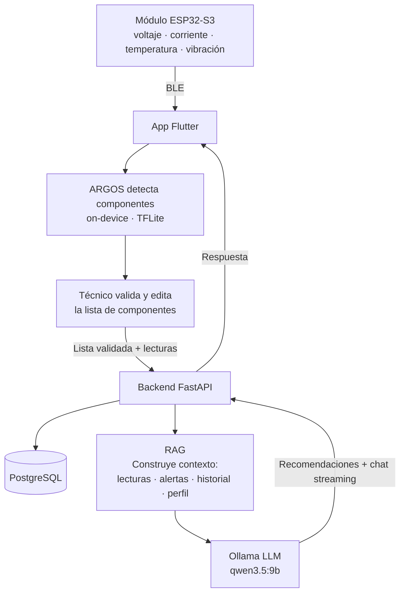

# ElectroScan — Sistema Inteligente de Diagnóstico y Mantenimiento de Placas Electrónicas

> Proyecto para la Cumbre Nacional InnovaTecNM 2026
> Categoría: Industria Eléctrica y Electrónica · Tecnologías Emergentes

---

## ¿Qué es?

ElectroScan es un sistema portátil que combina **visión artificial**, **monitoreo eléctrico en tiempo real** e **IA generativa con RAG** para diagnosticar y dar mantenimiento preventivo a placas electrónicas.

El técnico conecta el módulo al circuito, toma una foto con la app, y en segundos obtiene:
- Lista de componentes identificados automáticamente (editable)
- Lecturas de voltaje, corriente, temperatura y vibración en tiempo real
- Alertas preventivas antes de que ocurra una falla
- Recomendaciones de mantenimiento generadas por un LLM con contexto real del dispositivo
- Chat contextual para hacer preguntas sobre el estado del circuito

---

## El problema que resuelve

El diagnóstico de fallas en circuitos electrónicos es lento, manual y depende de la experiencia del técnico. En entornos industriales, una falla no detectada a tiempo puede generar paros de producción con pérdidas de $50,000–$500,000 MXN. No existe una herramienta accesible que combine identificación visual de componentes con monitoreo eléctrico en una sola solución portátil.

---

## Arquitectura general



---

## Componentes del sistema

### ARGOS — Modelo de visión artificial (on-device)
Modelo YOLOv8n entrenado desde cero para detectar componentes electrónicos directamente en el celular, sin necesidad de conexión al servidor.

- Dataset: ElectroCom-61 + dataset PCB fusionados en Roboflow (2,976 imágenes)
- Resultados: mAP50 = 0.721 · Precision = 0.758 · Recall = 0.667
- Exportado a TFLite float32 (12 MB) para Flutter con `tflite_flutter`
- Detecta: resistencias, capacitores, LEDs, transistores, ICs, diodos, buzzers, relays, módulos Arduino, ESP32, y más

### RAG — Contexto para el LLM
Antes de enviar cualquier pregunta al LLM, el backend construye automáticamente un contexto con información real del dispositivo:

```
Contexto enviado al LLM:
├── Últimas lecturas eléctricas (voltaje, corriente, temperatura, vibración)
├── Alertas recientes del dispositivo
├── Componentes detectados en el último diagnóstico
└── Perfil de voltaje configurado (3.3V / 5V / 12V / custom)
```

Esto permite que el LLM responda preguntas como "¿por qué está subiendo la temperatura?" con datos reales del circuito, no respuestas genéricas.

### Backend — Python + FastAPI
API REST completamente funcional y dockerizada.

- Auth JWT (access 30min + refresh 30 días)
- Recepción de lecturas del ESP32 con evaluación automática de alertas
- Diagnósticos con integración al LLM vía Ollama
- Chat con streaming (respuesta palabra por palabra)
- Serie de tiempo de lecturas con agregados por hora/día/mes/año
- PostgreSQL con SQLAlchemy async

### App móvil — Flutter
- Escaneo de placa con ARGOS on-device
- Lista editable de componentes detectados (el técnico puede corregir, agregar o eliminar)
- Monitor en tiempo real con gauges (voltaje, corriente, temperatura, vibración)
- Estadísticas con gráficas por rango de tiempo
- Historial de diagnósticos
- Chat con IA contextual (streaming)
- Conexión BLE al módulo ESP32

### Hardware — Módulo ESP32-S3
- INA219 — voltaje y corriente (hasta 26V)
- DS18B20 — temperatura
- MPU6050 — vibración y aceleración
- OLED 0.96" SSD1306 — pantalla local sin necesidad del celular
- Sondas pogo pin para conexión no invasiva al circuito
- Alimentación portátil con LiPo (~6h autonomía)

---

## Stack tecnológico

| Capa | Tecnología |
|---|---|
| App móvil | Flutter |
| Visión artificial | ARGOS — YOLOv8n → TFLite (on-device) |
| Hardware | ESP32-S3, INA219, MPU6050, DS18B20 |
| Backend | Python + FastAPI |
| RAG / LLM | Ollama + qwen3.5:9b (MVP local) → AWS Bedrock (producción) |
| Base de datos | PostgreSQL (SQLAlchemy async) |
| Infraestructura MVP | Docker + laptop + ngrok |
| Infraestructura producción | AWS EC2 + RDS + S3 |
| Comunicación IoT | BLE (Bluetooth Low Energy) |

---

## Estado del proyecto

| Componente | Estado |
|---|---|
| Modelo ARGOS (YOLOv8n → TFLite) | ✅ Entrenado y exportado |
| Backend FastAPI completo | ✅ Implementado y probado |
| Auth JWT | ✅ Probado |
| Lecturas + Alertas automáticas | ✅ Probadas |
| Diagnósticos + RAG + LLM | ✅ Implementado — pendiente probar con Ollama activo |
| Chat streaming | ✅ Implementado |
| App Flutter | ⏳ Pendiente |
| Módulo ESP32 | ⏳ Pendiente |
| Integración ARGOS en Flutter | ⏳ Pendiente |

---

## Estructura del repositorio

```
📁 Desarollo/
├── 📁 backend/                     — API FastAPI (Docker listo para correr)
│   ├── main.py
│   ├── docker-compose.yml
│   ├── .env.example
│   ├── models/                     — ORM (usuarios, dispositivos, lecturas, etc.)
│   ├── routers/                    — Endpoints (auth, dispositivos, lecturas, chat...)
│   ├── schemas/                    — Validación Pydantic
│   └── services/                   — Lógica de negocio (LLM, alertas)
└── 📁 Modelo_IA_TensorFlowLite/
    └── data.yaml                   — Clases del modelo ARGOS

📁 General/                         — Documentación de diseño
├── App/                            — Pantallas, navegación, BLE
├── Backend/                        — Endpoints, servicios, DB
├── BaseDeDatos/                    — Esquema PostgreSQL completo
├── Circuito/                       — Hardware ESP32, sensores, pines
├── Escalabilidad/                  — Arquitectura AWS por etapas
├── IA/                             — ARGOS + RAG + LLM
└── PlanDeNegocios/                 — Modelo de negocio, mercado, roadmap
```

---

## Cómo correr el backend

```bash
cd Desarollo/backend
cp .env.example .env
docker-compose up --build
```

API disponible en `http://localhost:8000` · Swagger en `http://localhost:8000/docs`

> Requiere Docker. PostgreSQL corre en el puerto 5433. Para el LLM, tener Ollama corriendo localmente.

---

## Modelo de negocio

| Tier | Para quién | Modelo |
|---|---|---|
| Kit directo | Técnicos, talleres | Venta de hardware, software incluido |
| B2B Cloud | Plantas industriales | Licencia mensual multi-técnico |
| On-Premise | Industria regulada | VPC dedicada en AWS, datos 100% privados |

---

## Pendientes globales

- [ ] Desarrollar app Flutter
- [ ] Integrar ARGOS (TFLite) en Flutter
- [ ] Armar protoboard del módulo ESP32
- [ ] Probar integración Ollama con backend
- [ ] Configurar ngrok para demo
- [ ] Preparar pitch y memoria técnica para etapa local
- [ ] Definir nombre final / branding
