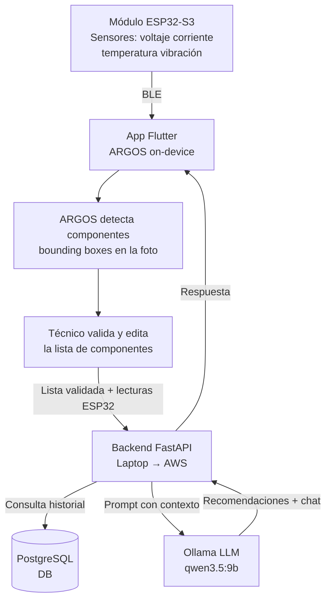

# ElectroScan — Sistema Inteligente de Diagnóstico y Mantenimiento de Placas Electrónicas

> Proyecto para la Cumbre Nacional InnovaTecNM 2026
> Categoría: Industria Eléctrica y Electrónica
> Eje transversal: Tecnologías Emergentes · Impacto Social · Sustentabilidad

---

## ¿Qué es?

Sistema portátil que combina **visión artificial**, **monitoreo eléctrico en tiempo real** e **inteligencia artificial generativa** para diagnosticar y dar mantenimiento preventivo a placas electrónicas.

El técnico conecta el módulo de hardware al circuito, toma una foto con la app, y en segundos obtiene:
- Lista de componentes identificados automáticamente (editable)
- Lecturas de voltaje, corriente, temperatura y vibración en tiempo real
- Alertas preventivas antes de que ocurra una falla
- Recomendaciones de mantenimiento generadas por un LLM
- Chat contextual para hacer preguntas sobre el estado del circuito

---

## ¿Para quién?

| Usuario | Beneficio |
|---|---|
| Técnico industrial | Diagnóstico rápido, documentado y sin depender solo de su experiencia |
| Jefe de mantenimiento | Alertas preventivas que evitan paros no planeados |
| Estudiante de electrónica | Herramienta educativa que identifica y explica componentes |

---

## Arquitectura general



---

## Componentes del sistema

### Hardware — Módulo ESP32-S3
- Microcontrolador ESP32-S3
- INA219 — voltaje y corriente (hasta 26V)
- DS18B20 — temperatura (con sondas a puntos específicos)
- MPU6050 — vibración y aceleración
- OLED 0.96" SSD1306 — pantalla local
- TP4056 + LiPo 2000mAh — alimentación portátil (~6h autonomía)
- Sondas pogo pin para conexión no invasiva al circuito

### App móvil — Flutter
- Escaneo de placa con foto + **ARGOS** on-device (TFLite)
- Lista editable de componentes detectados
- Monitor en tiempo real (gauges de voltaje, corriente, temperatura, vibración)
- Estadísticas con gráficas por rango de tiempo
- Historial de diagnósticos
- Chat con IA contextual (streaming)
- Conexión BLE al módulo ESP32

### Modelo de visión — ARGOS
- Basado en YOLOv8n entrenado desde cero
- Dataset fusionado: ElectroCom-61 + dataset PCB (2,976 imágenes)
- mAP50: 0.721 | Precision: 0.758 | Recall: 0.667
- Exportado a TFLite float32 (12 MB) para correr on-device en Flutter

### Backend — Python + FastAPI
- API REST para la app
- Integración con Ollama (LLM local en laptop → AWS Bedrock en producción)
- Jobs programados para agregación de lecturas (hora/día/mes/año)
- Autenticación JWT (access + refresh tokens)
- Dockerizado con PostgreSQL incluido

### Base de datos — PostgreSQL
- Usuarios, dispositivos, diagnósticos, componentes detectados
- Serie de tiempo de lecturas con agregados por granularidad
- Historial de chat por dispositivo
- Perfiles de voltaje personalizados con rangos para el LLM

---

## Stack tecnológico

| Capa | Tecnología |
|---|---|
| App móvil | Flutter |
| Visión artificial | ARGOS (YOLOv8n → TFLite, on-device) |
| Hardware | ESP32-S3, INA219, MPU6050, DS18B20 |
| Backend | Python + FastAPI |
| LLM (MVP) | Ollama + qwen3.5:9b (laptop local) |
| LLM (producción) | AWS Bedrock |
| Base de datos | PostgreSQL |
| Infraestructura MVP | Docker + laptop + ngrok |
| Infraestructura producción | AWS EC2 + RDS + S3 |
| Comunicación IoT | BLE (Bluetooth Low Energy) |

---

## Estructura del repositorio

```
📁 Desarollo/
├── 📁 backend/             — API FastAPI (Docker, modelos, routers, servicios)
└── 📁 Modelo_IA_TensorFlowLite/
    ├── best_float32.tflite — Modelo ARGOS exportado (ignorado por git, 12MB)
    └── data.yaml           — Clases del modelo

📁 General/
├── 📁 App/                 — Pantallas, navegación, BLE, paquetes Flutter
├── 📁 Backend/             — Documentación del backend
├── 📁 BaseDeDatos/         — Esquema PostgreSQL, tablas, índices
├── 📁 Circuito/            — Componentes, diagrama, pines, autonomía
├── 📁 Escalabilidad/       — Estrategia de escalado
├── 📁 IA/                  — Arquitectura del modelo ARGOS y LLM
└── 📁 PlanDeNegocios/      — Modelo de negocio, mercado, escalabilidad

📁 contextokiro/
├── Idea del proyecto.md
└── Convocatoria InnovaTecNM 2026.pdf
```

---

## Modelo de negocio

| Tier | Para quién | Modelo | Precio referencia |
|---|---|---|---|
| 1 — Kit directo | Técnicos, talleres | Venta de hardware, software incluido | $1,200 MXN/kit |
| 2 — B2B Cloud | Plantas industriales | Licencia mensual, multi-técnico | $2,500–6,000 MXN/mes |
| 3 — Tenant aislado | Industria regulada | VPC dedicada en AWS, datos 100% privados | $12,000–20,000 MXN/mes |

---

## Flujo de uso

```
1. Técnico conecta sondas del módulo ESP32 al circuito
2. Abre la app → toma foto de la placa
3. ARGOS identifica componentes on-device → lista editable
4. Técnico valida la lista
5. App envía lista + lecturas ESP32 al backend
6. Backend guarda en DB y consulta LLM con contexto
7. LLM genera recomendaciones de mantenimiento
8. App muestra resultados, alertas y permite chatear con la IA
9. Técnico guarda el diagnóstico en el historial
```

---

## Estado del proyecto

| Componente | Estado |
|---|---|
| Modelo ARGOS (YOLOv8n → TFLite) | ✅ Entrenado y exportado |
| Backend FastAPI | ✅ Implementado y probado |
| Base de datos PostgreSQL | ✅ Funcionando en Docker |
| Autenticación JWT | ✅ Probada |
| Lecturas + Alertas | ✅ Probadas |
| Diagnósticos + LLM | ✅ Implementado — pendiente probar con Ollama activo |
| App Flutter | ⏳ Pendiente |
| Módulo ESP32 | ⏳ Pendiente |
| Integración ARGOS en Flutter | ⏳ Pendiente |

---

## Pendientes globales

- [ ] Desarrollar app Flutter
- [ ] Integrar ARGOS (TFLite) en Flutter
- [ ] Armar protoboard del módulo ESP32
- [ ] Probar integración Ollama con backend
- [ ] Configurar ngrok para exponer el backend
- [ ] Preparar pitch y memoria técnica para etapa local
