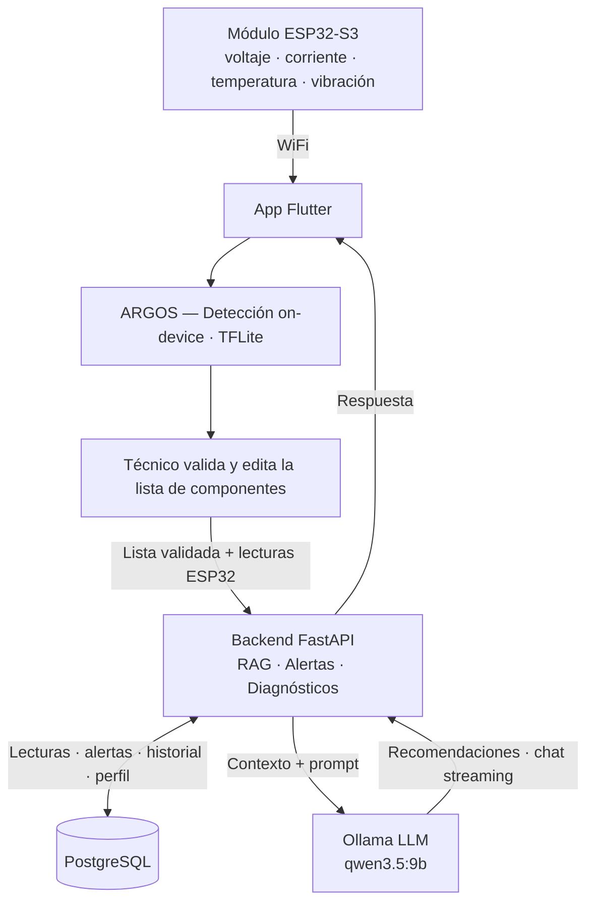

# [Nombre pendiente] — Sistema Inteligente de Diagnóstico y Mantenimiento de Placas Electrónicas

> Proyecto para la Cumbre Nacional InnovaTecNM 2026
> Categoría: Industria Eléctrica y Electrónica · Tecnologías Emergentes

---

## ¿Qué es?

Sistema portátil que combina **visión artificial**, **monitoreo eléctrico en tiempo real** e **IA generativa con RAG** para diagnosticar y dar mantenimiento preventivo a placas electrónicas.

El técnico conecta el módulo al circuito, toma una foto con la app, y en segundos obtiene:
- Lista de componentes identificados automáticamente (editable)
- Lecturas de voltaje, corriente, temperatura y vibración en tiempo real
- Alertas preventivas antes de que ocurra una falla
- Recomendaciones de mantenimiento generadas por un LLM con contexto real del dispositivo
- Chat contextual para hacer preguntas sobre el estado del circuito

---

## El problema que resuelve

El diagnóstico de fallas en circuitos electrónicos es lento, manual y depende de la experiencia del técnico. En entornos industriales, una falla no detectada a tiempo puede generar paros de producción con pérdidas de $50,000–$500,000 MXN. No existe una herramienta accesible que combine identificación visual de componentes con monitoreo eléctrico en una sola solución portátil.

---

## Arquitectura general



---

## Componentes del sistema

### ARGOS — Modelo de visión artificial (on-device)
Modelo YOLOv8n entrenado desde cero para detectar componentes electrónicos directamente en el celular, sin necesidad de conexión al servidor. El nombre viene de Argos Panoptes, el gigante de la mitología griega con cien ojos que todo lo veía — igual que el modelo, que "ve" y reconoce cada componente en la placa.

- Dataset: ElectroCom-61 + dataset PCB fusionados en Roboflow (2,976 imágenes)
- Resultados: mAP50 = 0.721 · Precision = 0.758 · Recall = 0.667
- Exportado a TFLite float32 (12 MB) para Flutter con `tflite_flutter`
- Detecta: resistencias, capacitores, LEDs, transistores, ICs, diodos, buzzers, relays, módulos Arduino, ESP32, y más

**ARGOS Pro (opcional, Tier 2):** la foto se envía a Gemini Vision para un análisis más profundo — valor de resistencias por código de colores, referencia de CIs, datasheet. Requiere conexión a internet y consume créditos de API.

### RAG — Contexto para el LLM
Antes de enviar cualquier pregunta al LLM, el backend consulta la DB y construye automáticamente un contexto con información real del dispositivo:

```
Backend consulta PostgreSQL y arma el contexto:
├── Última lectura eléctrica (voltaje, corriente, temperatura, vibración)
├── Alertas recientes del dispositivo
├── Últimos N mensajes del historial de chat
└── Perfil de voltaje configurado (3.3V / 5V / 12V / custom)
```

Ese contexto se inyecta como system message antes del prompt del usuario, permitiendo que el LLM responda preguntas como "¿por qué está subiendo la temperatura?" con datos reales del circuito, no respuestas genéricas.

### Backend — Python + FastAPI
API REST completamente funcional y dockerizada.

- Auth JWT (access 30min + refresh 30 días)
- Recepción de lecturas del ESP32 con evaluación automática de alertas
- Diagnósticos con integración al LLM vía Ollama
- Chat con streaming (respuesta palabra por palabra)
- Serie de tiempo de lecturas con agregados por hora/día/mes/año
- PostgreSQL con SQLAlchemy async

### App móvil — Flutter
- Escaneo de placa con ARGOS on-device
- Lista editable de componentes detectados (el técnico puede corregir, agregar o eliminar)
- Monitor en tiempo real con gauges (voltaje, corriente, temperatura, vibración)
- Configuración de voltaje esperado: perfil manual (3.3V/5V/12V/custom) o modo Auto (baseline de primeras 20 lecturas)
- Estadísticas con gráficas por rango de tiempo
- Historial de diagnósticos
- Chat con IA contextual (streaming)
- Conexión al módulo ESP32 vía WiFi (BLE como feature futuro)

### Hardware — Módulo ESP32-S3
- INA219 — voltaje y corriente (hasta 26V), conectado en serie en la línea de alimentación de la placa
- DS18B20 — temperatura, apoyado sobre la zona caliente del circuito
- MPU6050 — vibración y aceleración
- OLED 0.96" SSD1306 — pantalla local sin necesidad del celular
- Sondas tipo multímetro para conexión no invasiva al punto de alimentación
- **Modo portátil:** alimentación con LiPo (~6h autonomía), lecturas cada segundo
- **Modo fijo industrial:** alimentación directa de la red, monitoreo 24/7, intervalo configurable (1min - 1h)

---

## Stack tecnológico

| Capa | Tecnología |
|---|---|
| App móvil | Flutter |
| Visión artificial | ARGOS — YOLOv8n → TFLite (on-device) |
| Hardware | ESP32-S3, INA219, MPU6050, DS18B20 |
| Backend | Python + FastAPI |
| RAG / LLM | Ollama + qwen3.5:9b (MVP local) → AWS Bedrock (producción) |
| Base de datos | PostgreSQL (SQLAlchemy async) |
| Infraestructura MVP | Docker + laptop + ngrok |
| Infraestructura producción | AWS EC2 + RDS + S3 |
| Comunicación IoT | WiFi (ESP32 → Backend directo) · BLE futuro |

---

## Estado del proyecto

| Componente | Estado |
|---|---|
| Modelo ARGOS (YOLOv8n → TFLite) | Entrenado y exportado |
| Backend FastAPI completo | Implementado y probado |
| Auth JWT | Probado |
| Lecturas + Alertas automáticas | Probadas |
| Diagnósticos + RAG + LLM | Implementado — pendiente probar con Ollama activo |
| Chat streaming | Implementado |
| App Flutter | Pendiente |
| Módulo ESP32 | Pendiente |
| Integración ARGOS en Flutter | Pendiente |

---

## Estructura del repositorio

```
Desarollo/
├── backend/                     — API FastAPI (Docker listo para correr)
│   ├── main.py
│   ├── docker-compose.yml
│   ├── .env.example
│   ├── models/                     — ORM (usuarios, dispositivos, lecturas, etc.)
│   ├── routers/                    — Endpoints (auth, dispositivos, lecturas, chat...)
│   ├── schemas/                    — Validación Pydantic
│   └── services/                   — Lógica de negocio (LLM, alertas)
└── Modelo_IA_TensorFlowLite/
    └── data.yaml                   — Clases del modelo ARGOS

General/                         — Documentación de diseño
├── App/                            — Pantallas, navegación
├── Backend/                        — Endpoints, servicios, DB
├── BaseDeDatos/                    — Esquema PostgreSQL completo
├── Circuito/                       — Hardware ESP32, sensores, pines
├── Escalabilidad/                  — Arquitectura AWS por etapas
├── IA/                             — ARGOS + RAG + LLM
└── PlanDeNegocios/                 — Modelo de negocio, mercado, roadmap
```

---

## Cómo correr el backend

```bash
cd Desarollo/backend
cp .env.example .env
docker-compose up --build
```

API disponible en `http://localhost:8000` · Swagger en `http://localhost:8000/docs`

> Requiere Docker. PostgreSQL corre en el puerto 5433. Para el LLM, tener Ollama corriendo localmente.

---

## Modelo de negocio

El modelo principal es venta de hardware con margen. El técnico compra el dispositivo y el software va incluido sin costo adicional. Para empresas con múltiples técnicos aplica una licencia mensual. Para industria regulada que no puede mandar datos fuera de sus instalaciones, se ofrece un entorno completamente aislado en AWS.

| Tier | Para quién | Modelo |
|---|---|---|
| Kit directo | Técnicos, talleres | Venta de hardware, software incluido |
| B2B Cloud | Plantas industriales | Licencia mensual multi-técnico |
| On-Premise | Industria regulada | VPC dedicada en AWS, datos 100% privados |

> Una planta que evita un solo paro de producción recupera el costo anual del plan en minutos. Ver `General/PlanDeNegocios/plan-de-negocios.md` para el desglose completo.

---

## Equipo

- Diego Aragón
- Michelle de la Fuente
- Dulce
- Kevin
- Por definir

**Asesor:** Ing. Carlos Valenzuela
**Asesor:** Por definir

---

## Feature extra — Análisis de Weibull (si el tiempo lo permite)

Si el desarrollo avanza bien antes de la etapa local, se planea integrar análisis de Weibull para elevar el nivel predictivo del sistema.

### Qué es

El análisis de Weibull es un modelo estadístico que estima la probabilidad de falla de un componente en función del tiempo y su historial de operación. Es ampliamente usado en ingeniería de confiabilidad industrial.

### Cómo funcionaría en el sistema

Con el historial acumulado de lecturas por dispositivo (voltaje, corriente, temperatura, vibración), el backend calcularía la distribución de Weibull para cada variable y estimaría la vida útil restante del circuito:

```
Historial de lecturas (PostgreSQL)
        ↓
Servicio de Weibull (scipy.stats.weibull_min)
        ↓
Parámetros β (forma) y η (escala)
        ↓
Probabilidad de falla en los próximos N días
        ↓
Alerta predictiva: "Este circuito tiene 78% de probabilidad de falla en 15 días"
```

### Diferencia con las alertas actuales

| Alerta actual | Con Weibull |
|---|---|
| "El voltaje está fuera de rango ahora" | "Basado en el historial, este componente fallará en ~15 días" |
| Reactiva al momento | Predictiva con horizonte de tiempo |
| Sin contexto histórico | Aprende del comportamiento del dispositivo |

### Requisito

Necesita historial acumulado de varios ciclos de operación para ser estadísticamente válido. Para el MVP se puede demostrar con datos sintéticos realistas.

---

## Pendientes globales

- [ ] Desarrollar app Flutter
- [ ] Integrar ARGOS (TFLite) en Flutter
- [ ] Armar protoboard del módulo ESP32
- [ ] Probar integración Ollama con backend
- [ ] Configurar ngrok para demo
- [ ] Preparar Memoria Técnica y Modelo de Negocios para etapa local
- [ ] Definir nombre final / branding
