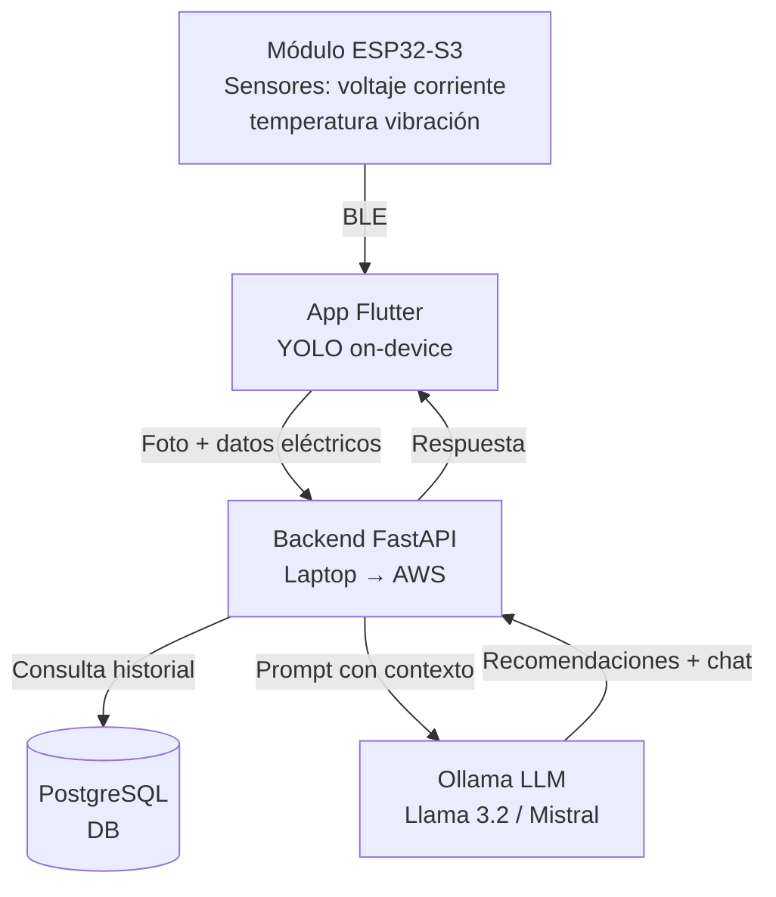

# [Nombre del proyecto] — Sistema Inteligente de Diagnóstico y Mantenimiento de Placas Electrónicas

> Proyecto para la Cumbre Nacional InnovaTecNM 2026
> Categoría: Industria Eléctrica y Electrónica
> Eje transversal: Tecnologías Emergentes · Impacto Social · Sustentabilidad

---

## ¿Qué es?

Sistema portátil que combina **visión artificial**, **monitoreo eléctrico en tiempo real** e **inteligencia artificial generativa** para diagnosticar y dar mantenimiento preventivo a placas electrónicas.

El técnico conecta el módulo de hardware al circuito, toma una foto con la app, y en segundos obtiene:
- Lista de componentes identificados automáticamente (editable)
- Lecturas de voltaje, corriente, temperatura y vibración en tiempo real
- Alertas preventivas antes de que ocurra una falla
- Recomendaciones de mantenimiento generadas por un LLM
- Chat contextual para hacer preguntas sobre el estado del circuito

---

## ¿Para quién?

| Usuario | Beneficio |
|---|---|
| Técnico industrial | Diagnóstico rápido, documentado y sin depender solo de su experiencia |
| Jefe de mantenimiento | Alertas preventivas que evitan paros no planeados |
| Estudiante de electrónica | Herramienta educativa que identifica y explica componentes |

---

## Arquitectura general



---

## Componentes del sistema

### Hardware — Módulo ESP32-S3
- Microcontrolador ESP32-S3
- INA219 — voltaje y corriente (hasta 26V)
- DS18B20 — temperatura (con sondas a puntos específicos)
- MPU6050 — vibración y aceleración
- OLED 0.96" SSD1306 — pantalla local
- TP4056 + LiPo 2000mAh — alimentación portátil (~6h autonomía)
- Sondas pogo pin para conexión no invasiva al circuito

### App móvil — Flutter
- Escaneo de placa con foto + YOLO on-device (TFLite)
- Lista editable de componentes detectados
- Monitor en tiempo real (gauges de voltaje, corriente, temperatura, vibración)
- Estadísticas con gráficas por rango de tiempo
- Historial de diagnósticos
- Chat con IA contextual (streaming)
- Conexión BLE al módulo ESP32

### Backend — Python + FastAPI
- API REST para la app
- Integración con Ollama (LLM local en laptop → AWS Bedrock en producción)
- Jobs programados para agregación de lecturas (hora/día/mes/año)
- Autenticación JWT (access + refresh tokens)

### Base de datos — PostgreSQL
- Usuarios, dispositivos, diagnósticos, componentes detectados
- Serie de tiempo de lecturas con agregados por granularidad
- Historial de chat por dispositivo
- Perfiles de voltaje personalizados con rangos para el LLM

---

## Stack tecnológico

| Capa | Tecnología |
|---|---|
| App móvil | Flutter |
| Visión artificial | YOLOv8n → TFLite (on-device) |
| Hardware | ESP32-S3, INA219, MPU6050, DS18B20 |
| Backend | Python + FastAPI |
| LLM (MVP) | Ollama + Llama 3.2 3B (laptop local) |
| LLM (producción) | AWS Bedrock |
| Base de datos | PostgreSQL |
| Infraestructura MVP | Laptop + ngrok |
| Infraestructura producción | AWS EC2 + RDS + S3 |
| Comunicación IoT | BLE (Bluetooth Low Energy) |

---

## Estructura del repositorio de planificación

```
📁 General/
├── 📁 App/
│   └── app.md              — Pantallas, navegación, BLE, paquetes Flutter
├── 📁 Circuito/
│   └── circuito.md         — Componentes, diagrama, pines, autonomía
├── 📁 BaseDeDatos/
│   └── base-de-datos.md    — Esquema PostgreSQL, tablas, índices, estrategia de retención
└── 📁 PlanDeNegocios/
    └── plan-de-negocios.md — Modelo de negocio, mercado, escalabilidad, propiedad intelectual

📁 docs/
├── Idea del proyecto.md    — Descripción general y stack
└── comvocatoria            — Convocatoria InnovaTecNM 2026
```

---

## Modelo de negocio

| Tier | Para quién | Modelo | Precio referencia |
|---|---|---|---|
| 1 — Kit directo | Técnicos, talleres | Venta de hardware, software incluido | $1,200 MXN/kit |
| 2 — B2B Cloud | Plantas industriales | Licencia mensual, multi-técnico | $2,500–6,000 MXN/mes |
| 3 — Tenant aislado | Industria regulada | VPC dedicada en AWS, datos 100% privados | $12,000–20,000 MXN/mes |

> El Tier 3 corre en una VPC dedicada en AWS por cliente, conectada a su red interna vía VPN. Los datos nunca se mezclan con otros clientes.

---

```
1. Técnico conecta sondas del módulo ESP32 al circuito
2. Abre la app → toma foto de la placa
3. YOLO identifica componentes on-device → lista editable
4. Técnico valida la lista
5. App envía lista + lecturas ESP32 al backend
6. Backend guarda en DB y consulta LLM con contexto
7. LLM genera recomendaciones de mantenimiento
8. App muestra resultados, alertas y permite chatear con la IA
9. Técnico guarda el diagnóstico en el historial
```

---

## MVP para InnovaTecNM (Etapa Local)

| Componente | Estado MVP |
|---|---|
| Módulo ESP32 en protoboard | ✅ Planificado |
| YOLO con 5-8 clases de componentes | ✅ Planificado |
| App Flutter básica (escanear + monitor + chat) | ✅ Planificado |
| Backend FastAPI en laptop | ✅ Planificado |
| Ollama + Llama 3.2 en laptop | ✅ Planificado |
| PostgreSQL local | ✅ Planificado |

---

## Pendientes globales

- [ ] Definir nombre final del proyecto
- [ ] Entrenar modelo YOLOv8n con dataset de componentes
- [ ] Armar protoboard del módulo ESP32
- [ ] Desarrollar app Flutter
- [ ] Desarrollar backend FastAPI
- [ ] Configurar Ollama en laptop con Intel Arc (OpenVINO)
- [ ] Preparar pitch y memoria técnica para etapa local
